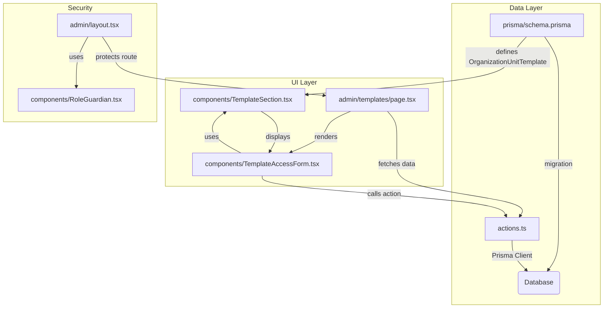

# Organization Template Management Feature

This document outlines the functionality of the Organization Template Management feature, which allows administrators to control which game assets (like Unit Templates, Perks, Weapons, etc.) are available for use within their organization.

## Feature Overview

The core purpose of this feature is to provide a granular access control layer for organization administrators (`OWNER` or `ADMIN` roles). Through a dedicated admin panel, they can select or deselect various game templates, effectively creating a curated list of available assets for all members of their organization. This ensures that campaigns and crews within an organization adhere to a specific ruleset or theme defined by the admins.

### Key Components

- **Secure Admin Section**: The entire feature is located under the `/organizations/[organizationId]/admin` route, which is protected by a layout that verifies the user's role. Only organization Owners and Admins can access this area.
- **Data-Driven Forms**: The management page fetches all available templates from the database and compares them against the templates currently enabled for the organization.
- **Centralized Management UI**: A single page at `/admin/templates` allows admins to manage all template types from one place.
- **Modular `TemplateSection` Component**: A reusable React component was developed to render the selectable lists for each template type, complete with "Select All" and "Deselect All" functionality.
- **Faction-Based Filtering**: Administrators can filter the list of Unit Templates by their parent Faction, making it easier to find and manage specific sets of units.
- **Transactional Updates**: All changes are saved via a server action that uses a database transaction to ensure that the updates are atomic and data integrity is maintained.

## Architecture and Data Flow

The following diagram illustrates the relationship between the different components of this feature, from the data layer up to the UI.

### How It Works

1.  When an admin navigates to the template management page, the `page.tsx` file fetches all base templates and the organization's current template selections from the database.
2.  This data is passed to the `TemplateAccessForm` client component, which manages the state of the user's selections.
3.  The form uses the `TemplateSection` component to display each category of templates in its own card with selection controls.
4.  When the admin saves their changes, the form calls the `updateTemplateAccess` server action.
5.  This action first verifies the user's permissions, then deletes all existing template links for the organization and creates new ones based on the admin's selections within a single database transaction.
