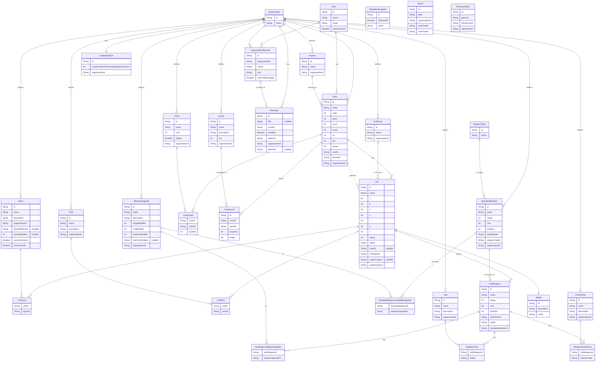

# Fallout Factions Tracker: Database Schema

This document outlines the database schema for the Fallout Factions Tracker application. The schema is designed to be flexible and extensible, allowing for future updates to the game rules.

## Schema Diagram



## Data Models Explanation

### Core Models

- **User**: Represents a registered user in the system. Linked to `OrganizationMember`.
- **Organization**: Represents a gaming group or community. Each organization is a self-contained campaign.
- **OrganizationMember**: A join table connecting `User` and `Organization`, defining a user's role within an organization. It includes a `canPostMessages` flag to control access to the message board.

### Campaign & Organization Models

- **CampaignRule**: A set of special rules for an organization's campaign, such as `maxNumberOfGamesAgainstSameCrew`. This has a one-to-one relationship with `Organization`.
- **Message**: A post or reply on the organization's message board. Can be hidden by administrators.
- **WastelandLegend**: Represents the official profile of a legendary unit. This record marks a `Unit` as a legend. The `isStandard` flag distinguishes between super-admin-created "official" legends and campaign-specific ones created by an organization admin.

### Gameplay & Metagame

- **Game**: Represents a single game session played between two crews within an organization. This model replaces the need for a separate `Rivalry` table, as the history of games between crews can be derived from this table.
- **TemporaryHire**: A record representing a contract to hire a legendary unit for a single `Game`. This links a `Crew` to a `Unit` whose `status` is `LEGENDARY`.

### Game-Specific Models

- **Crew**: The central model for a player's team. It belongs to a `User` (player) and a `Faction`. It tracks resources like `caps`, `xp`, and `parts`.
- **Faction**: A simple table to store the different playable factions (e.g., Brotherhood of Steel, Raiders). Each `Faction` is defined by an `Organization`.
- **Unit**: A member of a `Crew`. It has base `S.P.E.C.I.A.L.` attributes and a `status`. When a unit's status becomes `LEGENDARY`, its `crewId` is set to null, and it becomes a mercenary available for hire within its `Organization`.
- **UnitClass**: The role or specialization of a unit (e.g., Bruiser, Scavenger). Each `UnitClass` is defined by an `Organization`.
- **Model**: Represents the single physical miniature for a `Unit`, holding a description.

### Items & Upgrades

The following tables represent the "master list" of items and rules available within a campaign. Each of these is defined by an `Organization`, allowing community owners to customize their game worlds.

- **StandardWeapon**: A "template" for a weapon from the rulebook. It includes the weapon's `range`, `cost`, and the `testDice` and `testAttribute` required for skill checks.
- **UnitWeapon**: A specific instance of a `StandardWeapon` that belongs to a `Unit`. This is the record that gets customized with upgrades. Its stats are copied from the `StandardWeapon` initially.
- **WeaponUpgrade**: A modification that can be applied to a `UnitWeapon`. It can alter the weapon's range, cost, and even the dice and attribute used for its skill test.
- **Trait`&`CriticalTrait**: Special rules that apply to weapons.
- **Perk**: Special abilities or skills for a `Unit`.
- **Injury**: Describes the effects of a negative condition. It can modify a `SPECIAL` attribute, or cause the unit to become `ABSENT` or `DEAD`. The application is responsible for updating the `Unit.status` based on these flags.
- **Chem**: Consumable items a `Crew` can have in their stash.

### Gameplay & Metagame

- **Quest**: A goal a `Crew` can undertake. Like items, Quests are defined by an `Organization`.
- **CrewQuest**: Tracks a `Crew`'s progress on a specific `Quest`.

## Notes on Calculated Values

- **Reputation (Rep)**: This is a calculated value: `Rep = sum(unit.rating for all present units)`.
- **Unit Rating**: This is also a calculated value: `Unit Rating = unit.baseRating + sum(all applied weapon.cost)`.
  These values should be computed by the application on-demand rather than stored in the database to prevent data becoming stale.

This schema is designed based on the provided information and should be implemented in `prisma/schema.prisma`.

```

```
