# Fallout Factions Tracker: Database Schema

This document outlines the database schema for the Fallout Factions Tracker application. The schema is designed to be flexible and extensible, allowing for future updates to the game rules.

## Schema Diagram

```mermaid
erDiagram
    User {
        String id
        String name
        String email
        Boolean isSuperAdmin
    }

    Organization {
        String id
        String name
    }

    OrganizationMember {
        String id
        String organizationId
        String userId
        OrganizationRole role
    }

    Crew {
        String id
        String name
        Int caps
        Int parts
        Int scout
        Int reach
        Int xp
        Int tier
        Int power
        String userId
        String factionId
        String organizationId
    }

    Faction {
        String id
        String name
    }

    Unit {
        String id
        String name
        Int s
        Int p
        Int e
        Int c
        Int i
        Int a
        Int l
        Int rating
        Boolean absent
        String crewId
        String unitClassId
        String captorCrewId "nullable"
    }

    UnitClass {
        String id
        String name
    }

    Rivalry {
        String id
        String crewOneId
        String crewTwoId
        Int gamesPlayed
    }

    Injury {
        String id
        String name
        String description
    }

    UnitInjury {
        String unitId
        String injuryId
    }

    Perk {
        String id
        String name
        String description
    }

    UnitPerk {
        String unitId
        String perkId
    }

    Chem {
        String id
        String name
        Int cost
        Boolean isRare
    }

    CrewChem {
        String crewId
        String chemId
        Int quantity
    }

    Quest {
        String id
        String name
        String description
        Int tier
    }

    CrewQuest {
        String id
        String crewId
        String questId
        Int progress
        Int target
    }

    StandardWeapon {
        String id
        String name
        Int range
        Int cost
        String weaponTypeId
    }

    WeaponType {
        String id
        String name
    }

    UnitWeapon {
        String id
        String name
        Int range
        Int cost
        String unitId
        String standardWeaponId
    }

    WeaponUpgrade {
        String id
        String name
        String description
        Int rangeModifier
        Int costModifier
    }

    StandardWeaponAvailableUpgrade {
        String standardWeaponId
        String weaponUpgradeId
    }



    UnitWeaponAppliedUpgrade {
        String unitWeaponId
        String weaponUpgradeId
    }

    Trait {
        String id
        String name
        String description
    }

    WeaponTrait {
        String unitWeaponId
        String traitId
    }

    CriticalTrait {
        String id
        String name
        String description
    }

    WeaponCriticalTrait {
        String unitWeaponId
        String criticalTraitId
    }

    Model {
        String id
        String description
        String unitId
    }

    User ||--o{ OrganizationMember : ""
    Organization ||--o{ OrganizationMember : ""
    Organization ||--o{ Crew : ""
    User ||--o{ Crew : "has"
    Faction ||--o{ Crew : "belongs to"
    Crew ||--o{ Unit : "has"
    Crew ||--o{ Rivalry : "is crew one"
    Crew ||--o{ Rivalry : "is crew two"
    Crew ||--o{ CrewQuest : "tracks"
    Quest ||--o{ CrewQuest : "is instance of"
    UnitClass ||--o{ Unit : "is of class"
    Crew ||..o{ Unit : "captures"
    Unit ||--o{ UnitInjury : ""
    Injury ||--o{ UnitInjury : ""
    Unit ||--o{ UnitPerk : ""
    Perk ||--o{ UnitPerk : ""
    Crew ||--o{ CrewChem : ""
    Chem ||--o{ CrewChem : ""
    Unit ||--o{ UnitWeapon : "wields"
    StandardWeapon ||--o{ UnitWeapon : "is instance of"
    WeaponType ||--o{ StandardWeapon : "is of type"
    StandardWeapon ||--o{ StandardWeaponAvailableUpgrade : "can have"
    WeaponUpgrade ||--o{ StandardWeaponAvailableUpgrade : "is"
    UnitWeapon ||--o{ UnitWeaponAppliedUpgrade : "has"
    WeaponUpgrade ||--o{ UnitWeaponAppliedUpgrade : "is"
    UnitWeapon ||--o{ WeaponTrait : "has"
    Trait ||--o{ WeaponTrait : ""
    UnitWeapon ||--o{ WeaponCriticalTrait : "has"
    CriticalTrait ||--o{ WeaponCriticalTrait : ""
    Unit ||--o{ Model : ""


```

## Data Models Explanation

### Core Models

- **User**: Represents a registered user in the system. Linked to `OrganizationMember`.
- **Organization**: Represents a gaming group or community.
- **OrganizationMember**: A join table connecting `User` and `Organization`, defining a user's role within an organization.

### Game-Specific Models

- **Crew**: The central model for a player's team. It belongs to a `User` (player) and a `Faction`. It tracks resources like `caps`, `xp`, and `parts`.
- **Faction**: A simple table to store the different playable factions (e.g., Brotherhood of Steel, Raiders).
- **Unit**: A member of a `Crew`. It has `S.P.E.C.I.A.L.` attributes, a `rating`, and links to its `UnitClass`. It can be marked as `absent` and can be captured by another `Crew` (via `captorCrewId`).
- **UnitClass**: The role or specialization of a unit (e.g., Bruiser, Scavenger).
- **Model**: Represents the physical miniature for a `Unit`, holding a description.

### Items & Upgrades

- **StandardWeapon**: A "template" for a weapon from the rulebook. These are the base items units can acquire.
- **UnitWeapon**: A specific instance of a `StandardWeapon` that belongs to a `Unit`. This is the record that gets customized with upgrades.
- **WeaponUpgrade**: A modification that can be applied to a `UnitWeapon`. It includes modifiers for the weapon's stats.
- **Trait`&`CriticalTrait**: Special rules that apply to weapons.
- **Perk**: Special abilities or skills for a `Unit`.
- **Injury**: Negative effects that can be applied to a `Unit`.
- **Chem**: Consumable items a `Crew` can have in their stash. `CrewChem` tracks the quantity.

### Gameplay & Metagame

- **Quest**: A goal a `Crew` can undertake.
- **CrewQuest**: Tracks a `Crew`'s progress on a specific `Quest`.
- **Rivalry**: A record of the relationship and games played between two `Crews`.

## Notes on Calculated Values

- **Reputation (Rep)**: This is a calculated value: `Rep = sum(unit.rating for all present units)`.
- **Unit Rating**: This is also a calculated value: `Unit Rating = unit.baseRating + sum(all applied weapon.cost)`.
  These values should be computed by the application on-demand rather than stored in the database to prevent data becoming stale.

This schema is designed based on the provided information and should be implemented in `prisma/schema.prisma`.
